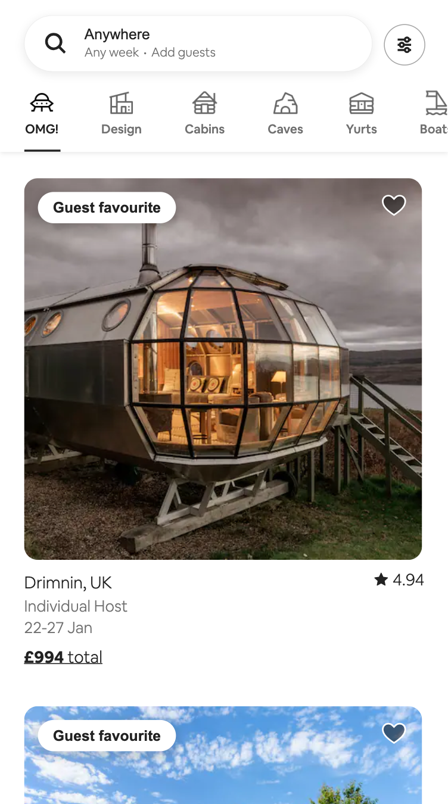

<!-- PROJECT LOGO -->

  

  <h3 align="center">Airbnb Clone</h3>

  

    An Airbnb mobile homepage clone - HTML and CSS only.
    

   
<a href="https://erinshien.github.io/weatherapp/">View Demo</a>

<!-- ABOUT THE PROJECT -->
## About The Project

### Introduction

This was my first ever coding project. It was made as a warm up in the lead up to beginning the School of Code bootcamp.

### Built With

* 
* 

(<a href="#readme-top">back to top</a>)

### The Process

I planned out my process in GitHub projects to practice GitHub Flow, merging, opening and closing pull requests.

(<a href="#readme-top">back to top</a>)

